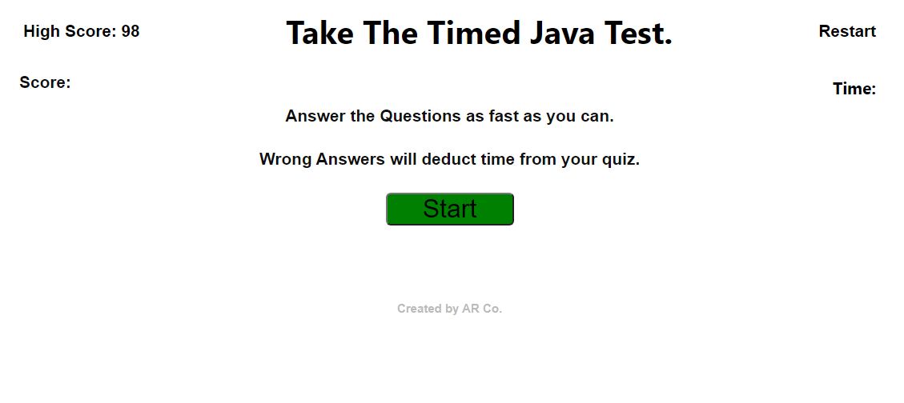

# Adam's Timed Java Test
​
**Quick Look**


## Description
​
Website for **Adams Timed Java Test** is used to challenge people on their knowledge of javascript in a timed setting.
​
## What it consists of
The test goes through a number of questions. The user must answer the questions quickly in set amount of time. This time equals the score. If they get a question wrong it will deduct time. If its a better score than last time it will be added to the highscores.

​
### Dependencies
​
* Windows 10
* HTML
* CSS

### Compatibility
* Chrome
* Firefox
* MS Edge
​
### Work with Us
​
* Git Clone if you wish to collaborate 
```
git clone https://github.com/AdamR-Work/java-quiz.git
```
​
### Site location
​
* https://adamr-work.github.io/java-quiz/


​
## Help
​
If you have any questions or concerns contact me at adamrfiles@gmail.com
​
## Authors

* AdamR-Work
​

## Version History
​
*
* 0.1
    * Initial Version
    * See [Commits history](https://github.com/AdamR-Work/java-quiz/commits/master)
​
## License
​
This project is licensed under the AdamR-Work License 
​
# java-quiz
